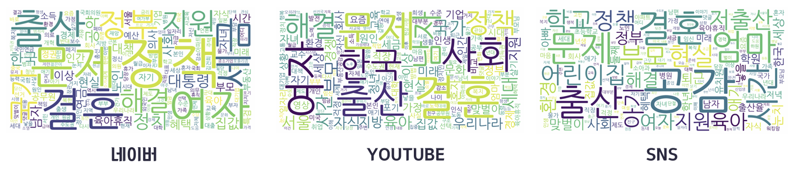
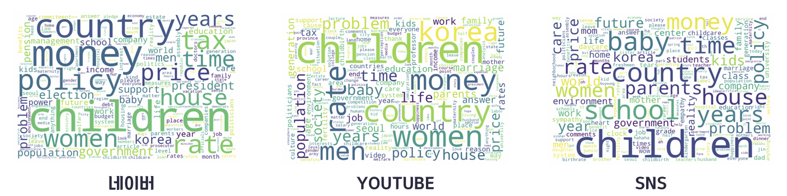

# 📉 OECD 데이터로 본 저출산 원인 분석  
**Machine Learning 02조 — 김규리 · 신한솔 · 최주현**

---

## 🧭 프로젝트 개요
최근 뉴스 속 저출산 대책들은 실효성이 낮고 현실과 괴리가 컸습니다.  
이에 팀은 **OECD 데이터를 기반으로 저출산의 실제 원인을 분석하고**,  
정책 방향과 비교·검토하는 프로젝트를 진행했습니다.

---

## 📋 목차
1. 주제 선정 배경  
2. 문제 정의  
3. 프로젝트 1 — 소셜 미디어 인식 분석  
4. 프로젝트 2 — OECD 데이터 요인 분석  
5. 인사이트 도출  
6. 결론 및 보완점  

---

## 🎯 주제 선정 배경
- 뉴스에서 반복되는 ‘현실성 낮은 저출산 정책’에 대한 문제의식  
- **“직접 데이터를 통해 원인을 찾아보자.”**  
- 사회적 인식(정성적 데이터) + 객관적 지표(정량적 데이터) 통합 접근  

---

## 🧩 프로젝트 1. 소셜 미디어 댓글 분석

### 🔍 문제 정의
> “사람들은 저출산의 원인을 무엇이라 인식할까?”

### 📊 분석 절차
1. YouTube, SNS, 네이버 뉴스 댓글 크롤링 (Selenium)  
2. 불용어 제거 및 데이터 정제  
3. TF-IDF 모델 기반 키워드 분석  
4. 워드클라우드 시각화  

### 📈 시각화 결과

| 원문 댓글 분석 | 영어 번역 후 분석 |
| :--------------: | :----------------: |
|  |  |

### 주요 키워드
**결혼, 출산, 정책, 세금, 시간, children, money, policy, tax**  
→ 사회적 인식상 **경제적 부담과 제도적 불신**이 가장 많이 언급됨  

---

## 📈 프로젝트 2. OECD 데이터 기반 요인 분석

### 🔍 문제 정의
> “OECD 국가들의 사회·경제적 요인 중, 출산율에 유의미한 변수는 무엇인가?”

### 📊 데이터 구성
- 출처: [OECD Data Portal](https://data.oecd.org)  
- 기간: 2010–2020년  
- 국가 수: 22개국  
- 종속변수: 합계출산율 → **출생아 수(역산 계산)**  
- 독립변수: 22개 사회·경제 지표  
  - 예: 남성·여성 고용률, 소득불평등, 연금 지출, GDP, 결혼율 등  

---

### ⚙️ 분석 절차
1. 다중공선성 확인 → 변수 제거 후 재적합  
2. 합계출산율 대신 출생아 수로 종속변수 교체  
   - 가임기 여성 인구 × 출산율 역산  
   - 단위 및 값 오류 정정  
3. 로그 변환 후 회귀 분석  

---

### 📊 회귀 결과 요약

| 변수 | 계수(β) | 유의성 |
| :------------- | :------: | :------: |
| 남성 고용률 | +0.86 | ✅ |
| 소득불평등 | +0.74 | ✅ |
| 연금 지출 | +0.44 | ✅ |
| 결혼율 | -0.29 | ❌ |
| 여성 고용률 | -0.15 | ❌ |

> **결론:** 연금, 소득불평등, 남성 고용률이 출산율과 높은 상관관계를 보임  

---

### 🌍 대표 국가 비교 (복지 체계 분석)

정재훈 교수(사회복지학과)의 조언을 바탕으로  
복지제도 유형이 서로 다른 **스웨덴, 독일, 미국**을 대표 국가로 비교했습니다.

| 구분 | 스웨덴 | 독일 | 미국 | 한국 |
| :-- | :-- | :-- | :-- | :-- |
| 복지 체계 | 사회민주주의 | 보수주의 | 자유주의 | 혼합형 |
| 국민 부담률 | 높음 | 중간 | 낮음 | 낮음 |
| 연금 제도 | 안정적, 선택 다양 | 법정보험 중심 | 선택형 제도 | 재정 불안정 |
| 고용 정책 | 청년 고용·육아 지원 | 직업훈련 중심 | 실업보험 중심 | 미스매칭 심화 |
| 출산율(2020) | 1.67 | 1.54 | 1.64 | 0.84 |

---

## 💡 인사이트 도출
- 소득불평등과 출산율 간 **U자형 관계** 확인  
  → 교육·복지 인프라가 취약한 국가일수록 출산율이 비정상적으로 높게 유지되는 현상 존재  
- 단순한 경제수준이 아니라 **삶의 질(QoL)**, **사회적 신뢰**가 출산율에 더 큰 영향을 미침  

---

## 🧭 결론 및 보완점

### 한계점
- 국가별 경제·사회 맥락을 충분히 반영하지 못함  
- 다중회귀모델만으로 복합적 요인을 설명하기 어려움  

### 보완 방향
- 연구 범위 축소 및 변수 세분화  
- 각국 정책을 **카테고리형 변수화 → Decision Tree 모델** 시도 예정  

---

## 🙏 느낀 점
데이터를 통해 확인한 저출산의 원인은 단순히 수치가 아니라  
**사회 구조와 인식의 교차점**에 있었습니다.  
현상을 설명하고 맥락을 짚어내는 과정이, 숫자 이상의 통찰을 만들어냈습니다.  

> “데이터 분석의 목적은 예측이 아니라, 이해다.” 

---

## 📁 프로젝트 구조
```
OECD-Fertility-Analysis/
│
├─ data/
│
├─ src/
│   ├─ 01_preprocessing.ipynb
│   ├─ 02_youtube_crawling.ipynb
│   ├─ 03_wordcloud.ipynb
│
├─ notebook/
│   └─ OECD_fertility_final.ipynb
│
└─ README.md
```

---

## 🧰 주요 기술 스택
`Python`, `Pandas`, `Seaborn`, `Matplotlib`, `Selenium`, `WordCloud`, `Scikit-learn`

---

**📎 추가 설명**

본 프로젝트는 실제로
네이버 뉴스 댓글, SNS 댓글 데이터, 유튜브 댓글 크롤링,
영어 번역 및 텍스트 전처리,
워드클라우드 시각화,
OECD 통계 기반 회귀분석
등의 과정을 모두 포함하고 있습니다.

현재 저장소에는 용량 제한 및 실행 환경 문제로 인해
일부 데이터셋과 중간 코드(예: 네이버·SNS 크롤링, 영어 변환 과정 등)는 제외되어 있습니다.
핵심 구조와 분석 흐름을 중심으로 재정리된 버전만 공개하였습니다.

---

📊 **전체 코드 보기:**  
[GitHub Repository](https://github.com/hansole27/OECD-Fertility-Analysis)

📒 **Colab에서 실행하기:**  
[OECD_Fertility_Final.ipynb](https://colab.research.google.com/github/hansole27/OECD-Fertility-Analysis/blob/main/notebook/OECD_fertility_final.ipynb)
